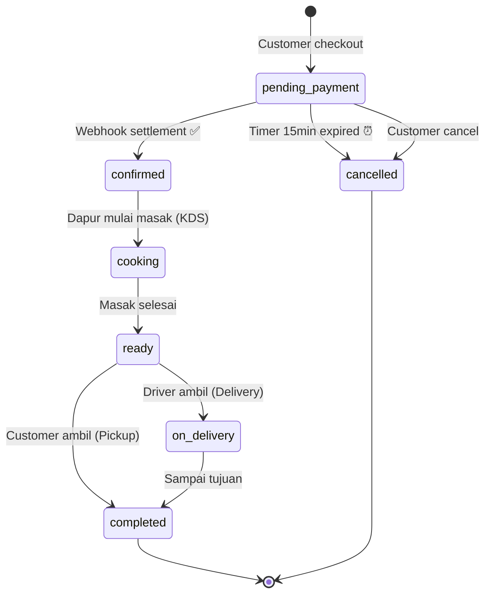
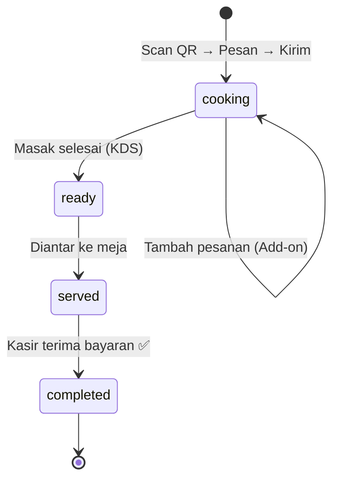

# 🍕 Omnichannel Pizzeria E-commerce — Arsitektur & Implementasi

## Konteks & Latar Belakang

Sistem saat ini sudah memiliki fondasi yang baik: dua alur pemesanan (Dine-In via QR & Online Delivery/Pickup), integrasi Midtrans, Kitchen Display System (KDS), dan manajemen stok. Namun ada beberapa celah arsitektural yang perlu diperbaiki agar memenuhi standar E-commerce sesungguhnya.

### Hasil Audit Kondisi Existing

| Aspek | Kondisi Saat Ini | Masalah |
|---|---|---|
| **Payments** | Kolom `payment_method`, `payment_status`, `snap_token` langsung di tabel `orders` | Tidak ada audit trail, tidak bisa track retry/expiry |
| **Order Status** | Enum: `new`, `cooking`, `ready`, `served` | Tidak ada status `waiting_payment`, `expired`, `on_delivery`, `completed`, `cancelled` |
| **Payment Status** | Enum: `pending`, `paid` | Tidak ada status `expired`, `cancelled`, `refunded` |
| **Webhook Security** | Callback via client-side AJAX, verifikasi ke Midtrans server API | **CELAH**: Endpoint `paymentCallback()` dan `paymentSuccessCallback()` bisa dipanggil siapapun tanpa signature validation |
| **Timer Expiry** | Tidak ada countdown 15 menit | Pesanan online bisa pending selamanya |
| **Dine-In Flow** | Session-based guest → langsung `cooking` | Sudah benar (frictionless). Tapi meminta nama & WA padahal seharusnya opsional |
| **Online Flow** | Wajib login, buat order → Snap Token → redirect ke status page | Alur sudah benar, tapi kurang proteksi webhook |

---

## User Review Required

> [!IMPORTANT]
> **Tabel `payments` Terpisah vs Kolom di `orders`**
> Rencana ini menambahkan tabel `payments` terpisah untuk menyimpan detail transaksi pembayaran (transaction_id, payment_channel, paid_at, dll). Ini standar E-commerce untuk audit trail. Kolom lama (`payment_method`, `payment_status`, `snap_token`) di tabel `orders` akan dipertahankan sebagai "summary" dan tetap di-sync.

> [!WARNING]
> **Breaking Change: Status Baru pada `order_status`**
> Status `order_status` akan diperluas dari `[new, cooking, ready, served]` menjadi `[pending_payment, confirmed, cooking, ready, on_delivery, completed, cancelled]`. Ini akan mempengaruhi semua query di Dashboard Admin, Cashier, Kitchen, dan Analytics. Semua view yang menampilkan status harus diperbarui.

> [!WARNING]
> **Breaking Change: Status Baru pada `payment_status`**  
> Status `payment_status` diperluas dari `[pending, paid]` menjadi `[unpaid, pending, paid, expired, cancelled, refunded]`. `unpaid` untuk Dine-In (belum bayar, bayar nanti di kasir), `pending` untuk Online (menunggu payment gateway).

---

## Open Questions

> [!IMPORTANT]
> **Q1: Dine-In — Apakah nama & WA tetap wajib?**
> Spesifikasi menyebutkan "Frictionless Ordering: Pelanggan tidak perlu login, tidak perlu isi alamat/nomor HP." Namun saat ini `CheckoutRequest` mewajibkan `customer_name` dan `customer_whatsapp`. Apakah kita ubah keduanya menjadi opsional untuk Dine-In?

> [!IMPORTANT]
> **Q2: Delivery Fee — Fixed atau Dinamis?**
> Saat ini delivery fee hardcoded Rp 15.000. Apakah tetap fixed atau ingin perhitungan berdasarkan jarak/zona?

> [!IMPORTANT]
> **Q3: Midtrans Server Key**
> Saat ini `.env` tidak memiliki `MIDTRANS_SERVER_KEY`. Webhook validation membutuhkan key ini. Apakah Anda sudah punya akun Midtrans Sandbox?

> [!IMPORTANT]
> **Q4: Voucher vs Promotion — Consolidate?**
> Saat ini ada dua model terpisah: `Voucher` (dipakai di Dine-In) dan `Promotion` (dipakai di Cashier). Keduanya melakukan hal yang sama. Apakah ingin digabung menjadi satu?

---

## Proposed Changes

### 1. ERD — Arsitektur Database Terpadu

#### Skema Tabel Inti (Setelah Perubahan)

```
┌──────────────────────────────┐
│           users              │
│──────────────────────────────│
│ id, name, email, password    │
│ role (admin|cashier|kitchen  │
│       |client)               │
│ phone_number, email_verified │
│ deleted_at (SoftDeletes)     │
└─────────┬────────────────────┘
          │ 1
          │
          ├───────────────────────── customer_addresses (1:N)
          │
          │ nullable (Dine-In = NULL)
          ▼ N
┌──────────────────────────────────────────────────────────────────┐
│                          orders                                  │
│──────────────────────────────────────────────────────────────────│
│ id                                                               │
│ order_number (VARCHAR UNIQUE) — Format: ORD-YYYYMMDD-XXXX        │
│ order_type (dine_in | delivery | pickup)                         │
│                                                                  │
│ # Polymorphic Ownership                                          │
│ user_id         FK → users (NULL untuk Dine-In guest)            │
│ table_id        FK → tables (NULL untuk Online)                  │
│ cashier_id      FK → users (kasir yang handle pembayaran)        │
│                                                                  │
│ # Customer Info (denormalized for speed)                         │
│ customer_name, customer_whatsapp, customer_email                 │
│ customer_address (TEXT, for delivery snapshot)                    │
│                                                                  │
│ # Financials                                                     │
│ subtotal_amount  DECIMAL(12,2)                                   │
│ delivery_fee     DECIMAL(12,2) DEFAULT 0                         │
│ discount_amount  DECIMAL(12,2) DEFAULT 0                         │
│ total_amount     DECIMAL(12,2) — subtotal - discount + delivery  │
│                                                                  │
│ # Promo                                                          │
│ promotion_id FK → promotions (NULL)                              │
│                                                                  │
│ # Status (State Machine)                                         │
│ order_status     VARCHAR(30)                                     │
│ payment_status   VARCHAR(30)                                     │
│                                                                  │
│ # Payment Summary (sync dari tabel payments)                     │
│ payment_method   VARCHAR(30) NULL                                │
│ snap_token       TEXT NULL                                       │
│ paid_at          TIMESTAMP NULL                                  │
│ expires_at       TIMESTAMP NULL (hanya Online — 15 menit)        │
│                                                                  │
│ # Kitchen                                                        │
│ cooking_started_at, cooking_completed_at                         │
│ stock_deducted BOOLEAN                                           │
│                                                                  │
│ timestamps                                                       │
└───────────┬──────────────────────────────────────────────────────┘
            │ 1
            │
            ├─── order_items (1:N) ── menu_id FK, qty, subtotal,
            │                         customization_notes, customization_ids
            │
            ▼ N
┌────────────────────────────────────────────────────────┐
│                    payments [NEW]                       │
│────────────────────────────────────────────────────────│
│ id                                                     │
│ order_id        FK → orders                            │
│ payment_method  VARCHAR(30) — qris, cash, bank_transfer│
│ payment_channel VARCHAR(50) — bca_va, gopay, shopeepay │
│ amount          DECIMAL(12,2)                           │
│ status          VARCHAR(20) — pending, settlement,      │
│                   capture, deny, cancel, expire, refund │
│ transaction_id  VARCHAR(100) — dari Midtrans            │
│ transaction_time TIMESTAMP NULL                         │
│ fraud_status    VARCHAR(20) NULL                        │
│ signature_key   TEXT NULL                               │
│ raw_response    JSON NULL — full payload dari gateway    │
│ timestamps                                              │
└────────────────────────────────────────────────────────┘
```

#### [NEW] Migration: `create_payments_table`

File baru untuk membuat tabel `payments` yang menyimpan setiap transaksi pembayaran.

#### [MODIFY] Migration: `upgrade_orders_for_ecommerce`

Menambah kolom baru pada tabel `orders`:
- `order_number` (VARCHAR UNIQUE) — Human-readable order ID
- `subtotal_amount` (DECIMAL) — Total sebelum diskon & ongkir
- `paid_at` (TIMESTAMP NULL)
- `expires_at` (TIMESTAMP NULL) — Batas waktu bayar untuk online order

Mengubah kolom existing:
- `order_status` dari ENUM ke VARCHAR(30)  
- `payment_status` dari ENUM ke VARCHAR(30)

---

### 2. State Machine Pesanan

#### Alur Online Order (Delivery / Pickup) — **Pre-paid, Anti-Scam**



| Status | payment_status | order_status | Keterangan |
|---|---|---|---|
| Checkout | `pending` | `pending_payment` | Menunggu bayar, timer 15 menit aktif |
| Bayar Sukses | `paid` | `confirmed` | Webhook received, pesanan masuk antrian dapur |
| Timer Habis | `expired` | `cancelled` | Otomatis oleh scheduler |
| Masak | `paid` | `cooking` | Dapur mulai (KDS) |
| Selesai Masak | `paid` | `ready` | Siap pickup/delivery |
| Dikirim | `paid` | `on_delivery` | Khusus delivery |
| Selesai | `paid` | `completed` | Transaksi selesai |

#### Alur Dine-In (QR Code) — **Post-paid, Frictionless**



| Status | payment_status | order_status | Keterangan |
|---|---|---|---|
| Pesan | `unpaid` | `cooking` | Langsung masuk dapur, belum bayar |
| Tambah | `unpaid` | `cooking` | Add-on ke order yang sama |
| Siap | `unpaid` | `ready` | Makanan siap |
| Disajikan | `unpaid` | `served` | Sudah di meja |
| Bayar | `paid` | `completed` | Kasir terima cash/QRIS |

---

### 3. Keamanan Webhook — Arsitektur Anti-Manipulasi

#### Masalah Saat Ini (Critical Security Issue)

File [OnlineOrderController.php](file:///d:/EXAMPP/htdocs/Pizzaria/app/Http/Controllers/Client/OnlineOrderController.php#L246-L291) — method `paymentCallback()`:

```php
// ❌ MASALAH: Endpoint ini bisa dipanggil siapapun via AJAX
// Customer bisa buka DevTools → jalankan POST request → order jadi "paid"
Route::post('/orders/{id}/payment-verify', [OnlineOrderController::class, 'paymentCallback']);
```

Walaupun ada verifikasi ke Midtrans API (`\Midtrans\Transaction::status()`), ini tetap **tidak aman** karena:
1. Endpoint terbuka tanpa auth middleware
2. Tidak ada signature validation dari Midtrans
3. Jika Midtrans API down, bisa di-bypass

#### Solusi: Server-to-Server Webhook

```
┌────────────┐     POST /api/webhook/midtrans      ┌──────────────┐
│  Midtrans   │ ──────────────────────────────────→ │   Server     │
│  Server     │  (signature_key + server_key hash)  │   (Laravel)  │
└────────────┘                                      └──────┬───────┘
                                                           │
                                                    1. Verify SHA512
                                                    2. Update payment
                                                    3. Update order
                                                    4. Deduct stock
                                                    5. Return HTTP 200
```

---

### 4. Alur Bukti Pemesanan & Digital Receipt (E-Receipt)

**Masalah Saat Ini:**
Pelanggan (Dine-in/QR maupun Online) setelah memesan tidak langsung mendapatkan kejelasan berupa struk, hasil transaksi, atau bukti pemesanan. Hal ini menimbulkan kebingungan bagi pelanggan (apakah pesanan sudah masuk dapur? kapan harus membayar? mana bukti transaksinya?).

**Solusi Arsitektur E-Commerce Profesional:**
Sistem harus membedakan antara **Bukti Pemesanan / E-Bill Sementara** (saat pesanan dibuat) dan **Struk Lunas / Official Receipt** (saat pesanan sudah dibayar). Keduanya disajikan secara digital (paperless) dan real-time.

#### A. Alur Pelanggan Dine-In (QR Code) - *Post-paid*
1. **Setelah Klik "Pesan"**: Pelanggan tidak langsung mendapat struk lunas, melainkan diarahkan ke halaman **Live E-Bill (Order Tracking)**.
2. **Isi Halaman Live E-Bill**:
   - Nomor Meja & Order ID (contoh: `ORD-20231024-001`).
   - Rincian item yang dipesan & Grand Total sementara (mendukung tambah pesanan / add-on di bill yang sama).
   - Status live dari dapur (Pesanan Diterima → Sedang Dimasak → Disajikan).
   - Call-to-action / Instruksi: *"Pesanan sedang diproses. Pembayaran dilakukan di Kasir setelah selesai bersantap."*
3. **Penerbitan Struk (Receipt)**: Setelah pelanggan ke Kasir dan membayar (status `completed`, payment `paid`), halaman Live E-Bill di HP pelanggan akan otomatis ter-update dan memunculkan tombol **"Lihat / Download Struk Digital"**.

#### B. Alur Pelanggan Online (Delivery/Pickup) - *Pre-paid*
1. **Setelah Checkout**: Pelanggan langsung diarahkan ke halaman **Waiting for Payment**.
2. **Isi Halaman Waiting Payment**:
   - Bukti Pemesanan Sementara (Order ID, Rincian Item, Biaya Ongkir, Grand Total).
   - Countdown Timer 15 Menit & Tombol Bayar.
3. **Penerbitan Struk (Receipt)**: Begitu pembayaran berhasil (Webhook Midtrans sukses), halaman ini akan otomatis berubah menjadi halaman **Live Order Tracking**.
4. **Isi Halaman Live Order Tracking**:
   - Status pesanan (Menunggu Konfirmasi → Dimasak → Sedang Dikirim).
   - Tombol **"Download Invoice / Struk Lunas"** sudah bisa diakses sebagai bukti bayar sah.

#### C. Perubahan Teknis yang Dibutuhkan untuk Fitur Ini
- **Fitur Auto-Refresh (Polling)**: Halaman tracking pesanan pelanggan (baik QR maupun Online) akan menggunakan AJAX polling (misal: tiap 5-10 detik) mengecek ke endpoint `/api/orders/{id}/status`. Begitu kasir/dapur mengubah status, layar HP pelanggan langsung berubah tanpa perlu di-refresh.
- **[NEW] Endpoint Generate Struk (PDF)**: Membuat endpoint khusus `GET /orders/{order_number}/receipt` yang menghasilkan file PDF Struk. Endpoint ini akan memvalidasi bahwa struk hanya bisa di-download jika `payment_status = 'paid'`.
- **Integrasi Struk Fisik & Digital**: Pada struk fisik yang dicetak oleh kasir (printer thermal), akan disematkan QR Code kecil di bagian bawah. Jika QR ini di-scan, akan membuka halaman Digital Receipt pelanggan di web.

---

### Rencana Perubahan Per Komponen

---

### Komponen A: Database Migrations

#### [NEW] `database/migrations/xxxx_create_payments_table.php`

Tabel baru `payments` untuk audit trail pembayaran.

#### [NEW] `database/migrations/xxxx_upgrade_orders_for_ecommerce.php`

Menambah kolom: `order_number`, `subtotal_amount`, `paid_at`, `expires_at`.  
Mengubah `order_status` dan `payment_status` ke VARCHAR jika masih ENUM.

---

### Komponen B: Models

#### [MODIFY] [Order.php](file:///d:/EXAMPP/htdocs/Pizzaria/app/Models/Order.php)

- Tambah relasi `payments()` → `hasMany(Payment::class)`
- Tambah boot method untuk auto-generate `order_number`
- Tambah scope `scopeExpiredPending()` untuk query expired orders
- Tambah status helper: `isWaitingPayment()`, `isConfirmed()`, `isOnDelivery()`
- Update `scopeForKitchen()` untuk mengikuti status baru (`confirmed`, `cooking`, `ready`)
- Update `scopeActive()` untuk exclude `cancelled`

#### [NEW] `app/Models/Payment.php`

Model baru dengan relasi `belongsTo(Order::class)`.

#### [MODIFY] [User.php](file:///d:/EXAMPP/htdocs/Pizzaria/app/Models/User.php)

- Tambah relasi `orders()`, `addresses()`

---

### Komponen C: Webhook & Payment Security

#### [NEW] `app/Http/Controllers/Api/MidtransWebhookController.php`

Controller baru khusus menangani notification dari Midtrans server-to-server.

```php
// Pseudocode Webhook Handler
class MidtransWebhookController extends Controller
{
    public function handle(Request $request, StockDeductionService $stockService)
    {
        // 1. Ambil raw payload
        $payload = $request->all();
        
        // 2. VALIDASI SIGNATURE (Anti-Manipulasi)
        $serverKey = config('midtrans.server_key');
        $signatureKey = hash('sha512', 
            $payload['order_id'] . 
            $payload['status_code'] . 
            $payload['gross_amount'] . 
            $serverKey
        );
        
        if ($signatureKey !== $payload['signature_key']) {
            Log::warning('Midtrans webhook: Invalid signature', $payload);
            return response()->json(['error' => 'Invalid signature'], 403);
        }
        
        // 3. Extract order ID dari format "ORD-123"
        $orderId = str_replace('ORD-', '', $payload['order_id']);
        $order = Order::find($orderId);
        
        if (!$order) {
            return response()->json(['error' => 'Order not found'], 404);
        }
        
        // 4. Simpan ke tabel payments (audit trail)
        Payment::updateOrCreate(
            ['transaction_id' => $payload['transaction_id']],
            [
                'order_id'         => $order->id,
                'payment_method'   => $payload['payment_type'],
                'payment_channel'  => $payload['va_numbers'][0]['bank'] ?? $payload['payment_type'],
                'amount'           => $payload['gross_amount'],
                'status'           => $payload['transaction_status'],
                'transaction_time' => $payload['transaction_time'],
                'fraud_status'     => $payload['fraud_status'] ?? null,
                'signature_key'    => $payload['signature_key'],
                'raw_response'     => $payload,
            ]
        );
        
        // 5. Handle berdasarkan transaction_status
        switch ($payload['transaction_status']) {
            case 'capture':
            case 'settlement':
                if ($order->payment_status !== 'paid') {
                    $order->payment_status = 'paid';
                    $order->payment_method = $payload['payment_type'];
                    $order->paid_at = now();
                    
                    // KUNCI: Online order baru masuk dapur SETELAH bayar
                    if ($order->isOnline() && $order->order_status === 'pending_payment') {
                        $order->order_status = 'confirmed';
                    }
                    $order->save();
                    
                    // Potong stok
                    try {
                        $stockService->deductOrderStock($order);
                    } catch (\Exception $e) {
                        Log::error("Stock deduction failed: " . $e->getMessage());
                    }
                }
                break;
                
            case 'deny':
            case 'cancel':
            case 'expire':
                $order->payment_status = 'expired';
                $order->order_status = 'cancelled';
                $order->save();
                break;
                
            case 'pending':
                // Midtrans mengirim status pending — order sudah di-create, tunggu bayar
                break;
        }
        
        // 6. Return 200 agar Midtrans tidak retry
        return response()->json(['status' => 'ok']);
    }
}
```

#### [MODIFY] Route: `routes/api.php`

Tambah route webhook:
```php
Route::post('/webhook/midtrans', [MidtransWebhookController::class, 'handle'])
    ->withoutMiddleware([\Illuminate\Foundation\Http\Middleware\VerifyCsrfToken::class]);
```

#### [MODIFY] Route: `routes/web.php`

Hapus/deprecate endpoint client-side callback yang tidak aman:
- `client.guest.orders.payment-success` 
- `client.online.orders.verify`

Ganti dengan polling endpoint yang aman (read-only, hanya cek status order):
```php
Route::get('/api/orders/{id}/status', fn($id) => Order::findOrFail($id)->only(['order_status', 'payment_status']));
```

---

### Komponen D: Timer Expiry (Auto-Cancel)

#### [NEW] `app/Console/Commands/ExpireUnpaidOrders.php`

Command Artisan yang dijalankan via scheduler setiap menit:

```php
class ExpireUnpaidOrders extends Command
{
    protected $signature = 'orders:expire-unpaid';
    
    public function handle()
    {
        $expired = Order::where('payment_status', 'pending')
            ->whereIn('order_type', ['delivery', 'pickup'])
            ->where('order_status', 'pending_payment')
            ->where('expires_at', '<=', now())
            ->get();
            
        foreach ($expired as $order) {
            $order->update([
                'payment_status' => 'expired',
                'order_status' => 'cancelled',
            ]);
            
            // Cancel di Midtrans juga
            try {
                \Midtrans\Transaction::cancel('ORD-' . $order->id);
            } catch (\Exception $e) {
                Log::warning("Failed to cancel Midtrans txn for Order #{$order->id}");
            }
        }
        
        $this->info("Expired {$expired->count()} unpaid orders.");
    }
}
```

#### [MODIFY] `routes/console.php`

```php
Schedule::command('orders:expire-unpaid')->everyMinute();
```

---

### Komponen E: Controller Updates

#### [MODIFY] [OnlineOrderController.php](file:///d:/EXAMPP/htdocs/Pizzaria/app/Http/Controllers/Client/OnlineOrderController.php)

- `processCheckout()`: Ubah `order_status` dari `'new'` menjadi `'pending_payment'`, set `expires_at` = `now()->addMinutes(15)`
- `paymentCallback()`: **Deprecate** — pindah logika ke webhook. Ganti dengan method `checkStatus()` yang hanya GET read-only.

#### [MODIFY] [ClientMenuController.php](file:///d:/EXAMPP/htdocs/Pizzaria/app/Http/Controllers/ClientMenuController.php)

- `checkout()`: Ubah `payment_status` dari `'pending'` menjadi `'unpaid'` untuk Dine-In
- `paymentSuccessCallback()`: **Deprecate** — ganti dengan webhook

#### [MODIFY] [KitchenController.php](file:///d:/EXAMPP/htdocs/Pizzaria/app/Http/Controllers/Kitchen/KitchenController.php)

- `index()`: Update query untuk mengikuti status baru:
  - "Pesanan Baru" = `order_status = 'confirmed'` (bukan `'new'`)
  - "Sedang Dimasak" = tetap `'cooking'`
  - "Siap" = tetap `'ready'`
- `startCooking()`: Ubah dari `'new' → 'cooking'` menjadi `'confirmed' → 'cooking'`

#### [MODIFY] [Cashier OrderController](file:///d:/EXAMPP/htdocs/Pizzaria/app/Http/Controllers/Cashier/OrderController.php)

- `index()`: Ubah query filter dari `payment_status = 'pending'` ke `payment_status = 'unpaid'` (khusus dine-in)
- `updateStatus()`: Tambah status `'completed'`, handle flow `served → completed` saat bayar

#### [MODIFY] [Admin OrderController](file:///d:/EXAMPP/htdocs/Pizzaria/app/Http/Controllers/Admin/OrderController.php)

- Update filter status agar mengikuti status baru
- Tambah filter `cancelled`, `expired`

---

### Komponen F: Views (Status Label Updates)

Semua view yang menampilkan badge status perlu diupdate untuk mendukung status baru:

| File | Perubahan |
|---|---|
| [admin/dashboard.blade.php](file:///d:/EXAMPP/htdocs/Pizzaria/resources/views/admin/dashboard.blade.php) | Update status badge colors |
| [admin/orders/index.blade.php](file:///d:/EXAMPP/htdocs/Pizzaria/resources/views/admin/orders/index.blade.php) | Tambah filter `pending_payment`, `confirmed`, `cancelled` |
| [admin/orders/show.blade.php](file:///d:/EXAMPP/htdocs/Pizzaria/resources/views/admin/orders/show.blade.php) | Update status display |
| [cashier/dashboard.blade.php](file:///d:/EXAMPP/htdocs/Pizzaria/resources/views/cashier/dashboard.blade.php) | Update untuk `unpaid` |
| [kitchen/display.blade.php](file:///d:/EXAMPP/htdocs/Pizzaria/resources/views/kitchen/display.blade.php) | Kolom pertama jadi `confirmed` |
| [client/order_status.blade.php](file:///d:/EXAMPP/htdocs/Pizzaria/resources/views/client/order_status.blade.php) | Update status tracking |
| [client/online_order_status.blade.php](file:///d:/EXAMPP/htdocs/Pizzaria/resources/views/client/online_order_status.blade.php) | Tambah countdown timer 15 menit, status `pending_payment` |

---

### Komponen G: Dine-In Frictionless Improvements

#### [MODIFY] [CheckoutRequest.php](file:///d:/EXAMPP/htdocs/Pizzaria/app/Http/Requests/CheckoutRequest.php)

Ubah `customer_name` dan `customer_whatsapp` menjadi `nullable` (opsional) untuk dine-in, sesuai spesifikasi frictionless.

#### [MODIFY] [client/layouts/app.blade.php](file:///d:/EXAMPP/htdocs/Pizzaria/resources/views/client/layouts/app.blade.php)

Update checkout modal/form agar nama & WA menjadi opsional saat mode dine-in.

---

## Verification Plan

### Automated Tests

```bash
# Setelah migration
php artisan migrate

# Syntax check semua file PHP yang diubah
php -l app/Http/Controllers/Api/MidtransWebhookController.php
php -l app/Models/Payment.php
php -l app/Models/Order.php
php -l app/Console/Commands/ExpireUnpaidOrders.php

# Test scheduler command
php artisan orders:expire-unpaid

# Test route list
php artisan route:list --path=webhook
php artisan route:list --path=orders
```

### Manual Verification

1. **Alur Online Order**:
   - Register → Login → Pilih menu → Checkout delivery → Verifikasi status `pending_payment` → Cek countdown 15 menit → Simulasi webhook settlement → Verifikasi status berubah ke `confirmed`

2. **Alur Dine-In**:
   - Scan QR (`/client/catalog?table=1`) → Pilih menu → Checkout tanpa nama/WA → Verifikasi order langsung `cooking` dengan `payment_status = unpaid`

3. **Timer Expiry**:
   - Buat online order → Tunggu / jalankan `php artisan orders:expire-unpaid` → Verifikasi status `cancelled`

4. **Webhook Security**:
   - Kirim POST ke `/api/webhook/midtrans` dengan signature salah → Harus ditolak 403
   - Kirim POST dengan signature benar → Order harus terupdate

5. **Kitchen Display**:
   - Verifikasi kolom KDS mengikuti status baru: `confirmed` → `cooking` → `ready`
