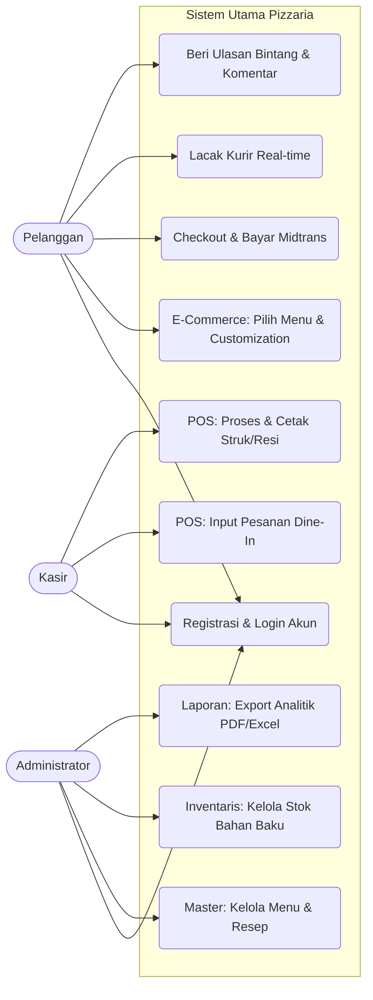

# SOFTWARE REQUIREMENTS SPECIFICATION (SRS)
**Sistem Terintegrasi Pizzaria (E-Commerce & Point of Sales)**

| Informasi Dokumen | Detail |
|---|---|
| **Nama Proyek** | Pizzaria - Integrated Management System |
| **Versi Dokumen** | 2.0.0 (Enterprise Comprehensive Edition) |
| **Tanggal Rilis** | 27 Juni 2026 |
| **Penyusun** | Tim Pengembang Pizzaria |
| **Standar Referensi** | Adaptasi IEEE 830-1998 |

---

## DAFTAR ISI
1. Pendahuluan
2. Deskripsi Keseluruhan (Overall Description)
3. Model Kasus Penggunaan (Use Case Diagram)
4. Kebutuhan Fungsional Terinci (Detailed Functional Requirements)
5. Antarmuka Pemrograman Aplikasi (API & Webhooks)
6. Kebutuhan Non-Fungsional (Non-Functional Requirements)
7. Batasan & Aturan Bisnis (Business Rules)

---

## 1. PENDAHULUAN

### 1.1 Latar Belakang & Tujuan
Restoran Pizzaria menghadapi tantangan dalam mensinkronisasi pesanan dari pelanggan yang datang langsung (Dine-in) dan pelanggan daring (Online Delivery). Ketiadaan sinkronisasi menyebabkan selisih inventaris bahan baku dan keterlambatan pengiriman. Dokumen Spesifikasi Kebutuhan Perangkat Lunak (SRS) ini memaparkan solusi sistem *omnichannel* terpusat yang mencakup *Point of Sales* (POS) untuk Kasir, Portal *E-Commerce* untuk Pelanggan, Otomatisasi Pemotongan Stok (Inventaris), dan Otomatisasi Pemanggilan Kurir melalui integrasi pihak ketiga.

### 1.2 Cakupan Sistem (Scope)
Sistem ini **AKAN** menangani:
- Penjualan langsung di restoran (Kasir/POS).
- Pemesanan online oleh pelanggan (E-Commerce).
- Pembayaran *Cashless* otomatis (Midtrans Gateway).
- Perhitungan tarif ongkos kirim dan manajemen pengiriman (Biteship API).
- Manajemen Inventaris Bahan Baku dinamis berdasarkan resep menu.
- Analitik penjualan dan laporan kinerja.

Sistem ini **TIDAK AKAN** menangani:
- Manajemen penggajian (Payroll) atau absensi kehadiran pegawai (HRIS).
- Akuntansi perpajakan lanjutan (Buku Besar/General Ledger).

### 1.3 Definisi & Akronim
- **POS**: *Point of Sales* (Titik Penjualan Kasir).
- **RBAC**: *Role-Based Access Control* (Sistem hierarki hak akses).
- **UAT**: *User Acceptance Testing*.
- **Waybill**: Resi pelacakan pengiriman kurir.

---

## 2. DESKRIPSI KESELURUHAN

### 2.1 Lingkungan Operasi (Operating Environment)
Sistem dibangun dalam arsitektur web dan dirancang untuk di-*hosting* pada lingkungan *cloud* modern:
- **Server OS**: Ubuntu 22.04 LTS / CentOS 8.
- **Web Server**: Nginx 1.24+ atau Apache 2.4+.
- **Bahasa Pemrograman**: PHP 8.2 (Kerangka Kerja Laravel 12).
- **Basis Data**: MySQL 8.0+ atau MariaDB 10.6+.
- **Klien yang Didukung**: Google Chrome (v100+), Safari (v15+), Microsoft Edge, dan Mozilla Firefox. Responsif terhadap layar *Mobile* (Pelanggan) dan Layar Sentuh *Tablet* (Kasir).

### 2.2 Klasifikasi Aktor & Hak Akses
1. **Administrator (Admin)**
   - *Fungsi*: Pengendali utama aplikasi.
   - *Hak Akses*: Menambahkan Staf/Kasir, Mengelola Menu & Bahan Baku, Menyetujui Ulasan, Menarik Laporan Penjualan Excel/PDF.
2. **Kasir (Cashier)**
   - *Fungsi*: Operator harian restoran.
   - *Hak Akses*: Mengakses POS, memproses pesanan masuk dari E-Commerce, menandai makanan selesai (*Ready*), mencetak resi pengiriman, menerima pembayaran tunai.
3. **Pelanggan (Client / Customer)**
   - *Fungsi*: Pengguna akhir yang memesan makanan.
   - *Hak Akses*: Melihat menu, memasukkan ke keranjang, mengklaim promo, *checkout* pembayaran Midtrans, dan melacak status kurir secara *real-time*.

---

## 3. MODEL KASUS PENGGUNAAN (USE CASE DIAGRAM)

---

## 4. KEBUTUHAN FUNGSIONAL TERINCI (DETAILED FUNCTIONAL)

Bagian ini mendeskripsikan setiap proses yang wajib dijalankan oleh sistem.

### 4.1 Modul Registrasi & Autentikasi (FR-AUTH)

| ID | Nama Fitur | Deskripsi & Aturan Bisnis |
|---|---|---|
| **FR-AUTH-01** | Registrasi Pelanggan | Pengunjung tak dikenal (Guest) dapat mendaftar dengan *Email* (harus unik), *Nama*, dan *Password* (minimal 8 karakter). Akun akan otomatis mendapat role `client`. |
| **FR-AUTH-02** | Login Sesi Tunggal | Sistem memvalidasi kredensial pengguna menggunakan mekanisme *Hashing Bcrypt*. Jika gagal 5 kali berturut-turut, sistem memberlakukan *Cooldown* selama 1 menit (Proteksi *Brute-force*). |
| **FR-AUTH-03** | Manajemen Staf | Admin dapat membuat akun baru dan menetapkan otorisasi sebagai `cashier` atau `admin`. Karyawan tidak bisa mengubah perannya sendiri. |

### 4.2 Modul E-Commerce Pelanggan (FR-ECOM)

| ID | Nama Fitur | Deskripsi & Aturan Bisnis |
|---|---|---|
| **FR-ECOM-01** | Penjelajahan Katalog | Sistem menampilkan daftar menu berdasarkan kategori. Menu yang kolom `is_available` bernilai `false` tidak akan dimunculkan di katalog publik. |
| **FR-ECOM-02** | Kustomisasi (*Add-ons*) | Saat menambah menu ke keranjang, sistem harus memunculkan *Pop-up* opsional untuk *Topping* tambahan (misal: Ekstra Sosis +Rp5.000). Harga otomatis dijumlahkan ke subtotal keranjang. |
| **FR-ECOM-03** | Kalkulator Ongkos Kirim | Sistem mengirimkan titik ordinat restoran (Tetap) dan titik ordinat pelanggan ke API Biteship. Sistem menampilkan minimal 3 opsi kurir beserta estimasi tarif *real-time*. |
| **FR-ECOM-04** | Logika Promo (Voucher) | Sistem harus memvalidasi: (1) Apakah kode promo masih berlaku (tanggal), (2) Apakah ada batas kuota, (3) Apakah pengguna baru (khusus *Welcome Promo*). |

### 4.3 Modul Point of Sales / Kasir (FR-POS)

| ID | Nama Fitur | Deskripsi & Aturan Bisnis |
|---|---|---|
| **FR-POS-01** | Antarmuka Pemesanan Cepat | Layar POS harus menampilkan kategori dalam bentuk tombol kotak (Grid) tanpa *reload* halaman. Setiap klik otomatis menambah item ke ringkasan tagihan di bilah kanan. |
| **FR-POS-02** | Manajemen Meja (*Dine-in*) | Kasir dapat memilih nomor Meja (`table_id`). Jika pelanggan *scan* QR Code dari meja, layar kasir otomatis menandai meja tersebut sedang memesan. |
| **FR-POS-03** | Pembayaran Manual | Kasir dapat memilih *Cash* (dan memasukkan nominal uang diterima, sistem menghitung kembalian) atau *QRIS Statis* (kasir memverifikasi manual melalui aplikasi Bank/E-Wallet restoran). |

### 4.4 Modul Manajemen Dapur & Pemotongan Stok (FR-INV)

*Ini adalah *core-engine* dari sistem Pizzaria.*

| ID | Nama Fitur | Deskripsi & Aturan Bisnis |
|---|---|---|
| **FR-INV-01** | Antrean Pemrosesan (Order Queue) | Semua pesanan berstatus `Paid` (Lunas) masuk ke layar Dapur/Kasir. Terdapat tombol "Proses". |
| **FR-INV-02** | Pemotongan Stok Bertingkat (Otomatis) | Ketika Kasir menekan "Proses", status pesanan berubah menjadi `Processing`. Sistem mengeksekusi iterasi ke setiap *Item*: (a) Kurangi 1 Porsi Stok Menu, (b) JIKA item memiliki opsi tambahan (Kustomisasi), kurangi juga stok bahan baku (`ingredients`) sesuai takaran yang disetujui (misal: -50 Gram Mozarella). |
| **FR-INV-03** | Alarm Persediaan (Stock Alert) | Jika pemotongan di FR-INV-02 mengakibatkan kuantitas bahan baku berada di bawah ambang batas (`minimum_stock_alert`), sistem membangkitkan notifikasi *Flash Message* berwarna merah muda muda kepada Admin. |

### 4.5 Modul Manajemen Pengiriman Logistik (FR-LOG)

| ID | Nama Fitur | Deskripsi & Aturan Bisnis |
|---|---|---|
| **FR-LOG-01** | Panggil Kurir Otomatis | Setelah dapur menyelesaikan makanan, Kasir menekan "Ready". Sistem **wajib** melakukan panggilan `POST` ke server Biteship untuk mengalokasikan kurir secara terprogram. |
| **FR-LOG-02** | Pembuatan Waybill (Resi) | Sistem menerima ID Resi dan ID Pelacakan dari Biteship, menyimpannya ke database `deliveries`, lalu membuka *tab* baru berisi pratinjau Struk Pengiriman berekstensi HTML/PDF untuk dicetak dan ditempel di boks. |

---

## 5. ANTARMUKA PEMROGRAMAN APLIKASI (API & WEBHOOKS)

Sistem dirancang asinkron menggunakan Webhooks untuk mencegah proses tunggu yang membekukan layar (UI Blocking) pelanggan.

### 5.1 Integrasi Payment Gateway (Midtrans)
- **Aksi Keluar (Generate Token)**: Sistem mengeksekusi CURL/Guzzle ke `https://app.midtrans.com/snap/v1/transactions` dengan Payload berisikan ID Order, Nama, dan Gross Amount.
- **Aksi Masuk (Webhook Callback)**: Sistem mengekspos endpoint `POST /api/webhook/midtrans`.
  - **Aturan Keamanan Webhook**: Sistem menghitung Hash SHA512 dari *Order ID + Status Code + Gross Amount + Server Key*. Jika cocok dengan atribut `signature_key` dari Midtrans, pesanan dinyatakan lunas (`Paid`).

### 5.2 Integrasi Ekspedisi Logistik (Biteship)
- **Aksi Keluar (Request Pickup)**: Sistem memukul endpoint `POST /v1/orders`. Payload mencakup Alamat Asal (Toko Pizzaria), Koordinat Tujuan (Pelanggan), Jenis Layanan (misal: Grab Instant), dan Barang (Makanan).
- **Aksi Masuk (Webhook Callback)**: Sistem mengekspos endpoint `POST /api/webhook/biteship`.
  - Jika event `order.status_updated` memiliki status `delivered`, sistem mengubah status pesanan pelanggan menjadi `Completed`.

---

## 6. KEBUTUHAN NON-FUNGSIONAL (NON-FUNCTIONAL REQUIREMENTS / NFR)

NFR menjabarkan standar mutu, keamanan, dan kinerja operasional sistem yang tidak tampak langsung di UI, namun vital bagi ketahanan aplikasi.

### 6.1 Parameter Kinerja (Performance)
- **NFR-PERF-01**: Halaman E-Commerce harus merender katalog penuh dalam waktu maksimal 2.5 detik pada koneksi pita lebar standar (4G LTE).
- **NFR-PERF-02**: Proses konfirmasi transaksi dari Kasir (POS) tidak boleh terhambat oleh proses API pihak ketiga; Sistem harus memisahkan pemanggilan API (seperti kirim email atau panggil kurir) menggunakan **Laravel Queues (Background Jobs)**.

### 6.2 Standar Keamanan & Perlindungan Data (Security)
- **NFR-SEC-01**: **Perlindungan Injeksi**: Semua parameter pencarian dan *input form* wajib disanitasi menggunakan fitur PDO dan *Eloquent Parameter Binding* (Mencegah SQL Injection).
- **NFR-SEC-02**: **Enkripsi Transit**: Komunikasi antara *browser* pengguna dengan *server* wajib diselimuti protokol keamanan Transport Layer Security (HTTPS/SSL/TLS 1.2+).
- **NFR-SEC-03**: **Otorisasi Ketat**: Tidak ada URL Admin/Kasir yang boleh terekspos tanpa perlindungan *Middleware Session*.

### 6.3 Skalabilitas & Ketersediaan (Scalability & Availability)
- **NFR-SCL-01**: Basis data *relational* (MySQL) harus mengimplementasikan **Foreign Key Constraint** dengan fungsi `ON DELETE CASCADE` atau `RESTRICT` yang ketat (misal: kategori tidak bisa dihapus jika masih ada menu aktif di dalamnya).
- **NFR-SCL-02**: Sistem harus tahan menangani lonjakan minimal 1,000 pengguna bersamaan (*Concurrent Users*) selama musim liburan/promosi tanpa menyebabkan *Crash Server*.
- **NFR-SCL-03**: Sistem pembersihan (*Garbage Collection*) via *Cron Job* akan menghapus seluruh data Keranjang Belanja dan Pesanan *Pending* (Kadaluarsa) setiap pukul 02:00 dini hari untuk menghemat ruang memori peladen (server).

---

## 7. BATASAN & ATURAN BISNIS KHUSUS (BUSINESS RULES)

Kaidah operasional yang berlaku mutlak dalam algoritma kode sumber Pizzaria:
1. **Aturan Harga Final**: Total Tagihan (`total_amount`) = (Harga Dasar Menu + Harga Total Kustomisasi) - Potongan Diskon Promo + Tarif Ongkos Kirim Biteship + Pajak PPN (11% secara default).
2. **Titik Henti Batal (Point of No Return)**: Pelanggan secara mandiri HANYA diizinkan membatalkan pesanan jika statusnya masih `Pending`. Jika sudah berstatus `Paid` atau `Processing`, pembatalan secara teknis terkunci dan hanya Admin yang memiliki kewenangan intervensi pembatalan (*Force Cancel*).
3. **Penyimpanan Alamat**: Satu akun pelanggan (`user_id` peran `client`) dapat menyimpan banyak alamat `customer_addresses`, namun wajib memilih satu yang aktif sebagai titik kirim saat setiap *checkout*.

---
*(Akhir dari Dokumen Spesifikasi Kebutuhan Perangkat Lunak - Versi Enterprise Terpadu)*
